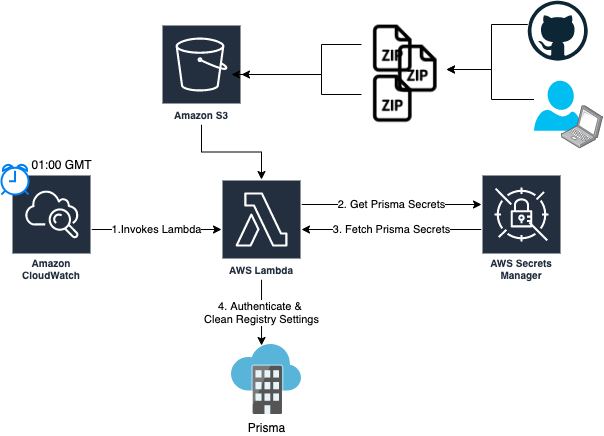

# prisma-lambdas


Repostiory for Prisma related lambda processes.

## Supported Lambdas

- Prisma Registry Cleaner
  - Cleans Registry setting on Prisma every day.

  

- Prisma Secret Rotator
  - Rotate Prisma Secrets every 30 days.

## How to run

### One Time Environment Setup
```bash
$ python3 -m venv .venv-local
$ source .venv-local/bin/activate
(.venv-local) $ pip install --upgrade pip
(.venv-local) $ pip install -r requirements-local.txt
(.venv-local) $ pre-commit install --install-hooks
(.venv-local) $ deactivate # Choice
```

### Creating Infrastructure
```bash
# Deactivate any other current venv
(xxxxxxx) $ deactivate

# Activate venv
$ source .venv-local/bin/activate

# Authenticate to specific AWS account.
(.venv-local) $ OKTA_DOMAIN="godaddy.okta.com"; KEY=$(openssl rand -hex 18); eval $(aws-okta-processor authenticate -e -o $OKTA_DOMAIN -u $USER -k $KEY)

# Navigate to sceptre folder
(.venv-local) $ cd sceptre

# Run sceptre to build infrasturcture & deploy lambda. ex) dev-private
(.venv-local) sceptre/ $ sceptre create dev-private
```

### Removing Infrastructure
```bash
# Deactivate any other current venv
(xxxxxxx) $ deactivate

# Activate venv
$ source .venv-local/bin/activate

# Authenticate to specific AWS account.
(.venv-local) $ OKTA_DOMAIN="godaddy.okta.com"; KEY=$(openssl rand -hex 18); eval $(aws-okta-processor authenticate -e -o $OKTA_DOMAIN -u $USER -k $KEY)

## MANUAL STEP: Log into AWS console, empty (including versions) of S3 bucket created from create run.

# Navigate to sceptre folder
(.venv-local) $ cd sceptre

# Remove infrastructure. ex) dev-private
(.venv-local) sceptre/ $ sceptre delete dev-private

# Exit venv
(.venv-local) sceptre/ $ deactivate
```
